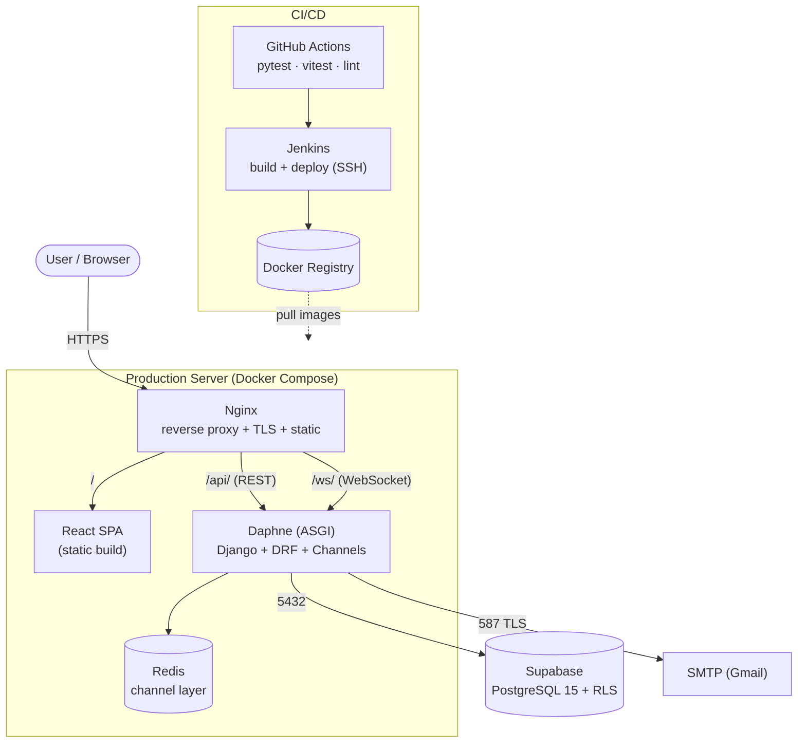
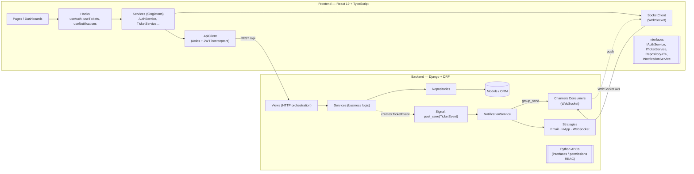
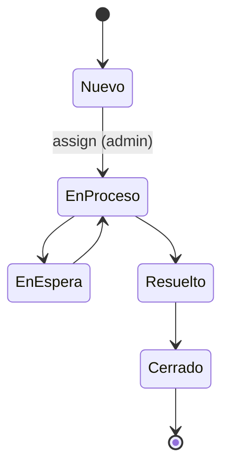

# SassBlum — Project Presentation (Section B)

> Master document for the recorded demonstration (10 min, in English, equal participation).
> Maps 1:1 to the six required points of the rubric. The quick speaker/timing map lives in
> [README.md](README.md); this document is the full content + diagrams + acceptance tests.

**Institution:** ESPOL — FIEC · **Client:** SassBlum (Vicky Pinto)
**Team:** Erick Armijos · Juan Pérez · Elías Rubio · Jahir Cajas · Jairo Rodríguez

---

## 1. System Introduction (client · scope · what it does)

**Who the client is.** SassBlum is an Ecuadorian technology company (Guayaquil) with 20+ years of
experience providing IT solutions — IT infrastructure, technical support, structured cabling, CCTV
surveillance, home automation and server sales. They act as an integrator between businesses and
technology providers (authorized partner of Hikvision, Ubiquiti, Grandstream and ZKTeco).

**Scope.** A full‑stack **ticket management system** for SassBlum's service operation, built for
**three roles** — **Client**, **Worker** and **Admin** — covering the complete lifecycle of a
service request from creation to closure, with real‑time notifications and reporting.

**What the system does.**
- Clients register, verify their email, browse the service catalog and open tickets (with attachments).
- Admins assign/reassign tickets to workers, manage users and generate/export reports.
- Workers update ticket status (state machine), add comments and close tickets.
- Every ticket event fires an **Observer** that dispatches notifications through three channels
  (email + in‑app + WebSocket) in real time.
- Full audit history per ticket; KPI reports exportable to CSV / PDF / Excel.

**Tech stack.** React 19 + TypeScript + Vite + Tailwind v4 (frontend) · Django + DRF + SimpleJWT +
Django Channels (backend) · Supabase PostgreSQL 15 with Row‑Level Security · Redis (channel layer) ·
Docker + GitHub Actions + Jenkins (CI/CD).

---

## 2. User Stories

The MVP implements **18 user stories (HU‑01 … HU‑18)**:

| # | Story | # | Story |
|---|-------|---|-------|
| HU‑01 | Login with credentials | HU‑10 | Filtering and search |
| HU‑02 | Client registration | HU‑11 | Comments on tickets |
| HU‑03 | Password recovery | HU‑12 | Ticket closure |
| HU‑04 | Ticket creation | HU‑13 | Real‑time visualization |
| HU‑05 | Ticket assignment | HU‑14 | Notification dispatch |
| HU‑06 | Ticket visualization | HU‑15 | Notification preferences |
| HU‑07 | Status update | HU‑16 | Notification history |
| HU‑08 | Ticket reassignment | HU‑17 | Report generation |
| HU‑09 | Ticket history | HU‑18 | Data export |

**Total: 18 user stories.**

---

## 3. Sprints

The system was built in **4 sprints (34 work sessions, S1–S34)**:

| Sprint | Dates | Modules delivered | Sessions |
|--------|-------|-------------------|----------|
| Sprint 1 | May 25–31 | Authentication (FE + BE) | S1–S10 |
| Sprint 2 | Jun 15–21 | Catalog + Tickets (creation & state machine) | S11–S18 |
| Sprint 3 | Jul 6–26 | Notifications + History + Password reset | S19–S27 |
| Sprint 4 | Jul 27–Aug 16 | Assignment + Reports + Realtime + Dashboards | S28–S34 |

**Total: 4 sprints / 34 sessions.** All four sprints delivered; MVP runs end‑to‑end.

---

## 4. Architecture

### 4.1 Deployment Diagram



### 4.2 Component Diagram (layered, DIP‑driven)



### 4.3 Ticket State Machine



> Every transition **requires a non‑empty comment (BR‑35)**; `Cerrado` is terminal.

### 4.4 Design Patterns & SOLID

| Pattern | Where |
|---------|-------|
| Repository | `AuthRepository`, `TicketRepository`, `NotificationRepository` |
| Factory | `NotificationFactory`, `ExporterFactory`, `ValidatorFactory` |
| Strategy | Email / InApp / WebSocket notifications · CSV/PDF/Excel exporters |
| Observer | Django signal `post_save(TicketEvent)` → `NotificationService` (+ realtime broadcast) |
| Singleton | `AuthService`, `TicketService`, `NotificationService`, `ApiClient` |
| Chain of Responsibility | `EmailValidator → PasswordValidator → RegistrationValidatorChain`; ticket validator chain |

**SOLID** is enforced across every module: SRP (model ≠ service ≠ serializer ≠ view), OCP (new
strategy/exporter/validator/state = additive, no edits), LSP (every concrete is swappable for its
interface), ISP (`IsClient`/`IsWorker`/`IsAdmin`; per‑role ticket interfaces), DIP (views/components
depend on interfaces only — `App.tsx` is the single concrete‑wiring boundary on the frontend).

---

## 5. Acceptance Testing — How users interact (one user per role)

> Demo data is loaded with `python manage.py seed_demo`. **Common password: `SassBlum2026`.**
> Acceptance criteria use **Given / When / Then**. Each role is driven by a dedicated account so
> "one user per role" appears in the recording.

### 5.1 CLIENT — `cliente@sassblum.com` (also real: `erick2003kimi@gmail.com`)

| ID | User story | Acceptance criteria (Given / When / Then) |
|----|-----------|-------------------------------------------|
| TC‑C1 | HU‑02 Registration | **Given** a new email **when** the client registers **then** the account is created with status *pendiente* and a verification email is sent. |
| TC‑C2 | HU‑03 Email verification / recovery | **Given** the verification link **when** opened **then** the account becomes *activo* and login is enabled. Forgot/Reset password issues a single‑use, 1‑hour token. |
| TC‑C3 | HU‑01 Login | **Given** valid verified credentials **when** logging in **then** a JWT is issued and the user lands on the client dashboard. |
| TC‑C4 | HU‑04 Ticket creation | **Given** a logged‑in client **when** creating a ticket (subject ≤80, description ≥10, service, optional attachment ≤5 MB) **then** the ticket is created as **Nuevo** and the Observer fires notifications. |
| TC‑C5 | HU‑06 Visualization | **Given** an existing ticket **when** opened **then** subject, service, priority, status badge, metadata and attachments are shown. |
| TC‑C6 | HU‑09 History | **Given** a ticket with activity **when** viewing history **then** all events appear in chronological order with author and timestamp. |
| TC‑C7 | HU‑10 Filter & search | **Given** the ticket list **when** filtering by status/priority **then** only matching tickets are shown (paginated). |
| TC‑C8 | HU‑15/16 Notifications | **Given** new in‑app notifications **when** opening the bell **then** unread count and history are shown; preferences toggle email/in‑app/WS. |

### 5.2 WORKER — `trabajador1@sassblum.com` (Carlos Técnico)

| ID | User story | Acceptance criteria (Given / When / Then) |
|----|-----------|-------------------------------------------|
| TC‑W1 | HU‑01 Login | **Given** worker credentials **when** logging in **then** the worker dashboard lists tickets assigned to them. |
| TC‑W2 | HU‑07 Status update | **Given** an assigned ticket in *EnProceso* **when** moving it to *EnEspera* **with a non‑empty comment** **then** the transition is accepted (BR‑35) and the client is notified; an empty comment is rejected. |
| TC‑W3 | HU‑11 Comments | **Given** an assigned ticket **when** adding a comment **then** it is appended to the history. |
| TC‑W4 | HU‑07 State machine | **Given** the lifecycle **when** transitioning Nuevo→EnProceso→EnEspera→EnProceso→Resuelto **then** only valid transitions are allowed (invalid ones return 422). |
| TC‑W5 | HU‑12 Closure | **Given** a *Resuelto* ticket **when** closing it **then** it reaches the terminal **Cerrado** state and can no longer transition. |
| TC‑W6 | HU‑13 Real‑time | **Given** an open ticket detail **when** another role changes it **then** the view updates live via WebSocket (no refresh). |

### 5.3 ADMIN — `admin@sassblum.com`

| ID | User story | Acceptance criteria (Given / When / Then) |
|----|-----------|-------------------------------------------|
| TC‑A1 | HU‑01 Login | **Given** admin credentials **when** logging in **then** the admin dashboard shows all tickets across clients. |
| TC‑A2 | HU‑05 Assignment | **Given** ticket **T‑2026‑9001** in *Nuevo* (seeded, unassigned) **when** assigning it to an active worker **then** status becomes **EnProceso** and the worker is notified. |
| TC‑A3 | HU‑08 Reassignment | **Given** an assigned ticket **when** reassigning to another worker **then** the change is recorded in history and both workers are notified. |
| TC‑A4 | HU‑17 Reports | **Given** ticket data **when** generating a report with date/status filters **then** KPIs and charts render (Recharts). |
| TC‑A5 | HU‑18 Export | **Given** a report **when** exporting **then** a CSV / PDF / Excel file downloads correctly. |
| TC‑A6 | HU‑14 User management | **Given** the user admin page **when** creating / blocking / unblocking a user **then** the change is persisted; a blocked user cannot log in. |

**Seeded tickets available for the demo** (one per lifecycle state):

| Number | Subject | State | Assigned |
|--------|---------|-------|----------|
| T‑2026‑9001 | Servidor de correo caído | **Nuevo** (unassigned) | — |
| T‑2026‑9002 | Cámara de seguridad sin señal | En Proceso | Carlos |
| T‑2026‑9003 | Cableado para nueva oficina | En Espera | Carlos |
| T‑2026‑9004 | Configurar domótica en sala de reuniones | Resuelto | Ana |
| T‑2026‑9005 | Mantenimiento preventivo de servidores | Cerrado | Ana |

---

## 6. Other Important Information

### 6.1 Non‑Functional Requirements (evaluation results)

| NFR | How it is met |
|-----|---------------|
| **Security** | JWT kept **in memory only** (never `localStorage`, XSS‑safe); refresh + blacklist on logout; Supabase **Row‑Level Security**; **RBAC** with segregated permission classes (`IsClient`/`IsWorker`/`IsAdmin`); account lockout after 5 failed logins; email verification via signed token. |
| **Performance** | Route‑level **code‑splitting** (main JS bundle 695 KB → **455 KB**, framer‑motion in its own cached chunk); GPU‑friendly animations (transform/opacity only, no animated blur/backdrop‑blur); indexed queries and `select_related`/`prefetch_related` (no N+1). |
| **Scalability** | Stateless API behind Nginx upstream (`--scale backend=N`); Redis channel layer for horizontal WebSocket scaling. |
| **Maintainability** | SOLID architecture; one responsibility per file; dependency inversion via interfaces; **102 backend tests** + frontend RTL tests; `flake8` clean. |
| **Accessibility / UX** | Visible focus states, `aria` labels, `prefers-reduced-motion` respected; responsive layout. |

### 6.2 Test Plan (review)

- **Backend — pytest (102 passing):** auth (login, registration, **5‑attempt lockout**, JWT), password
  reset (token valid/expired/used), ticket lifecycle (full state machine + invalid transitions),
  validator chain (each node isolated), ticket repository (role‑based access control), notification
  dispatch routing + per‑channel preferences, notification strategies in isolation, report exporters.
- **Frontend — Vitest + React Testing Library:** `LoginForm`, `TicketStatusBadge`, `CreateTicketForm`,
  `NotificationBell`, `useNotifications` (state after a WebSocket frame).
- **CI:** GitHub Actions runs lint → `tsc` → `pytest` → `vitest` → Docker build on every push.

### 6.3 API surface

30+ REST endpoints under `/api/` (`auth`, `servicios`, `tickets`, `notificaciones`, `usuarios`,
`reportes`) + 2 WebSocket routes (`ws/notifications/`, `ws/tickets/<id>/`). Full list in
[CLAUDE.md](CLAUDE.md) and [README.md](README.md).

### 6.4 How to run (for the demo)

```bash
# 1) Seed demo data (services, accounts, sample tickets)
cd backend && python manage.py seed_demo

# 2) Backend (WebSocket-capable ASGI server)
daphne config.asgi:application

# 3) Frontend
cd frontend && npm install && npm run dev   # http://localhost:5173
```

### 6.5 Recording plan (equal participation · ~10 min)

| Speaker | Covers (rubric point) | Time |
|---------|----------------------|------|
| Juan Pérez | §1 Introduction + tech stack | ~2.0 min |
| Jahir Cajas | §2 User stories + §3 Sprints | ~1.5 min |
| Jairo Rodríguez | §4 Architecture (deployment + component diagrams) + NFRs | ~2.0 min |
| Erick Armijos | §5 Demo — Client & Admin acceptance tests | ~2.5 min |
| Elías Rubio | §5 Demo — Worker + real‑time notifications + §6.2 test‑plan review | ~2.0 min |

> Deliverables to upload: the recorded demo video URL, this presentation file, and (optionally) the
> slide deck used during the demonstration.
